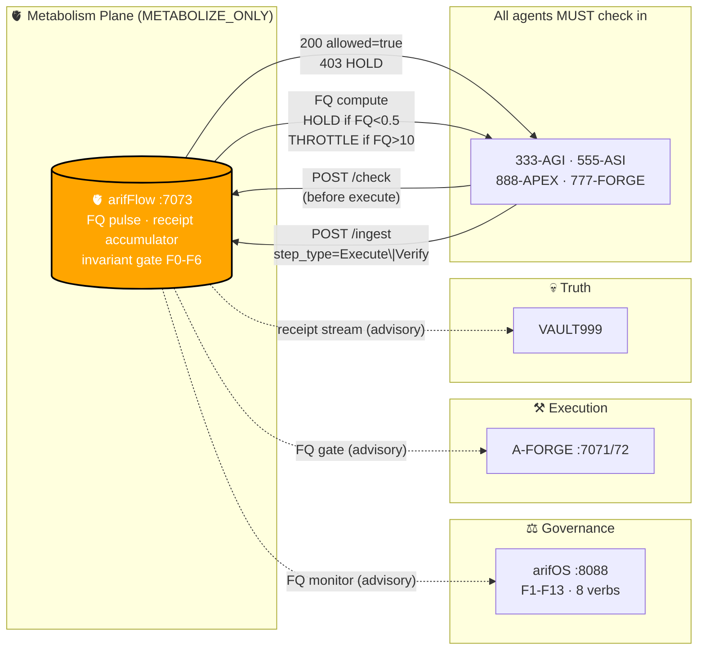

<!-- SOT-MANIFEST
federation_release: v2026.08.11
last_verified: 2026-08-11T23:24:40Z
live_commit: fe14d3f (feat(FINAL-4): flow closure — override receipt, fq canonical, WHY bridge)
organ: arifFlow
role: METABOLISM organ — FQ pulse, receipt metabolism, attention checkpointing
authority: METABOLIZE_ONLY — never judges, never executes
truth_rule: cargo test + curl :7073/health beat any prose below
-->

# 🫀 arifFlow — Metabolism & Attention Pulse

> **Constitutional Attention Pulse for the arifOS Federation**
>
> DITEMPA BUKAN DIBERI — Forged, Not Given.

**arifFlow** is the **metabolism organ** of the arifOS Federation. It runs a Rust daemon on port `7073` that watches every execute step in the federation, ingests receipts, computes **Flow Quotient (FQ)**, and emits HOLD/THROTTLE signals when execute outruns verify. It is the **nerve**, not the brain.

```
FQ = verify_count / execute_count
  FQ < 0.5  → HOLD   (verify is starving — block new execution)
  FQ > 10   → THROTTLE (execute outrunning verify — 30s cooldown)
  5+ exec without verify → HOLD (mandate verification)
```

arifFlow sits between the brain (arifOS :8088) and the hands (A-FORGE :7071). It is not a transport layer. It is an **active attention governor** — refusing execution when the federation's truth-metabolism is breaking.

---

## What arifFlow Is at Runtime (OBSERVED)

This section is the honest reconciliation. The federation's metabolism plane ships live; the governance plane is partially compiled but not all wired into the daemon path. Per the constitutional audit of 2026-08-10:

### Live at Runtime ✅
- HTTP daemon on `:7073` (GET /health, POST /ingest, POST /check, POST /release, POST /enforce, POST /flow)
- Receipt accumulator (in-memory + disk-persisted to `/var/lib/arifflow/receipts.jsonl`)
- Flow Quotient (FQ) monitor — six-state band per F13 spec (v2.1 formula)
- Invariant enforcer (F0-F6 flow-plane, with auto-enforcement cycle every 10s)
- Chain-aware ingest since 2026-08-10 (rejects receipts with invalid `previous_receipt_hash`)
- Fail-CLOSED advisory gate (Python client default since 2026-08-10)

### Compiled but Inactive at Runtime ⚠️
- BSP scheduler is compiled but not invoked from daemon (lives in `stdin_protocol_loop` only)
- Cross-organ coordination bridges (arifOS :8088, A-FORGE :7071) are compiled but not called
- VAULT999 sealing is not wired to runtime ingest path (receipts go to local JSONL)
- Merkle checkpointing is computed in scheduler path only (dead code at daemon runtime)

### Aspirational Architecture 📋
- Governed parallel execution engine
- Federation nervous system
- Constitutional BSP scheduler with cross-organ coordination

The gap is documented, not hidden. Resolution is deferred to F13 SOVEREIGN verdict. Until then: this section is the SOT for actual behavior.

---

## The 6 Flow-Plane Invariants (F0–F6)

| ID | Name | Rule | Enforcement |
|----|------|------|-------------|
| **F0** | Transmit, Never Own | Flow transmits, never originates intent | Architecture |
| **F1** | Schedule, Never Authorize | Scheduling ≠ permission | Architecture |
| **F2** | Checkpoint, Never Judge | Verdict grammar belongs to arifOS | Architecture |
| **F3** | Observe, Never Interpret | FQ measurement, drift detection | **AUTO** — FQ gate |
| **F4** | Route, Never Execute | Execution belongs to A-FORGE | Architecture |
| **F5** | Receipt, Never Own Memory | VAULT999 authority belongs to arifOS | Architecture |
| **F6** | Connect, Never Collapse | Organs are independent | Architecture |

---

## Agent Execution Flow (ALL agents MUST follow)

```
Before execute:
    POST /check {"actor_id": "333-AGI"}
    → 200 allowed=true  → proceed
    → 403 allowed=false → HOLD — send Verify receipt, then release

After execute:
    POST /ingest {step_type: "Execute", ...}

After verify:
    POST /ingest {step_type: "Verify", ...}
    POST /release {"actor_id": "333-AGI"}
```

### Client Libraries

**Shell:**
```bash
source /root/arifFlow/scripts/check.sh
arifflow_check "333-AGI"    # returns 0 if allowed, 1 if blocked
arifflow_release "333-AGI"  # release hold
```

**Python:**
```python
from arifflow.client import check, ingest, release

result = check("333-AGI")
if not result.allowed:
    raise SystemExit(f"HOLD: {result.reason}")

# ... execute ...

ingest("333-AGI", session_id, "Execute", "Observation", cost_ns)
```

---

## Endpoints

| Endpoint | Method | Purpose |
|----------|--------|---------|
| `/health` | GET | Status + FQ + invariant health + restricted actors |
| `/ingest` | POST | Ingest flow receipt, update actor FQ |
| `/check` | POST | **Invariant gate** — check if actor can execute |
| `/release` | POST | Release hold on actor after verification |
| `/enforce` | POST | Trigger enforcement cycle manually |

---

## The Body Is Complete

```
arifOS   = undang-undang �️  (law — the brain, :8088)
A-FORGE  = tangan 👐         (hands — the body, :7071)
arifFlow = saraf 🧠           (nerves — the flow, :7073)
FQ       = nadi ❤️            (pulse — the heartbeat)
VAULT999 = tulang 💀          (bones — the structure)
```

> **Bila FQ turun, semua HOLD. Bila FQ naik, semua forge.**  
> DITEMPA BUKAN DIBERI — dan ditempa dalam flow, bukan dalam drift.

---

## 🗺️ Where arifFlow Sits in the Federation



**arifFlow internal loop (FQ gate):**

```
agent wants to execute
        │
        ▼
POST /check {"actor_id": "333-AGI"}
        │
        ├─→ FQ compute (verify_count / execute_count over recent receipts)
        │
        ├─→ FQ < 0.5  → 403 HOLD (must Verify before re-check)
        ├─→ FQ > 10   → 200 + THROTTLE flag (30s cooldown)
        └─→ 0.5 ≤ FQ ≤ 10 → 200 allowed=true
        │
        ▼
agent executes (MUTATE in A-FORGE under SEAL)
        │
        ▼
POST /ingest {step_type: "Execute", ...}
        │
        ▼
POST /ingest {step_type: "Verify", ...}
        │
        ▼
POST /release {"actor_id": "333-AGI"} → FQ rebalances
```

**Hard rules (METABOLIZE_ONLY ceiling):**
- arifFlow never adjudicates. FQ is a *gate*, not a *verdict*. Verdict is arifOS.
- arifFlow never executes. The gate blocks; A-FORGE applies.
- arifFlow never owns memory. Receipts go to local JSONL; VAULT999 is arifOS-owned.

---

## 🏅 Federation Certification

[](https://arifflow.arif-fazil.com/health)
[](https://arif-fazil.com/999/verify)
[](https://github.com/ariffazil/arifos/blob/main/GENESIS/000_KERNEL_CANON.md)
[](https://github.com/ariffazil/arifFlow)

[](https://modelcontextprotocol.io)
[](https://github.com/ariffazil/arifFlow/blob/main/ARIFLOW_KERNEL_CANON.md)

[](https://github.com/ariffazil/arifFlow)
[](https://github.com/ariffazil/arifFlow)
[](https://github.com/ariffazil/arifFlow/blob/main/LICENSE)

---

## Federation Position

```
                  arifOS
               (Constitution)
                     │
                     ▼
        ┌─────── AAA ────────┐
        │   Control Plane    │
        │                    │
        │  arifFlow = MONITOR ← "What is happening right now?"
        │  FRAME     = AUDIT  ← "Has reality drifted?"
        │  FED       = ROUTE  ← "Which intelligence source should perform this task?"
        │  FLAME     = REASON ← "Execute low-cost cognition."
        └────────────────────┘
                     │
                     ▼
                 A-FORGE
               (Execution)
```

arifFlow is one of the four AAA State Infrastructure organs (alongside FRAME, FED, FLAME). It retains its own authority ceiling — AAA catalogs them; AAA does not command them.

---

## Quick Start

```bash
cargo build --release
cargo test
cargo clippy
cargo fmt

# Run daemon
./target/release/arifflow --port 7073

# Probe
curl -s http://127.0.0.1:7073/health | jq .
```

### Prerequisites
- Rust 2024 edition (1.85+)
- Tokio runtime

---

## Federation Contract

arifFlow is a **sovereign organ** — called by other organs via adapter:

- **Adapter:** `/root/A-FORGE/domain/orchestration/arifFlow_adapter.py`
- `POST /bridge/execute` — submit execution topology
- `GET /bridge/status/:id` — poll execution state
- `POST /bridge/cooling` — cooling queue enqueue

Every organ (GEOX, WEALTH, WELL, AAA, HERMES) may call arifFlow directly through its bridge interface. No organ imports another to reach the flow engine.

---

## Versioning & Release Cycle

**Iron Rule:** Date-stamped `vYYYY.MM.DD` (never semver).

```bash
cargo build --release
cargo test
# Bump Cargo.toml version → vYYYY.MM.DD
git tag vYYYY.MM.DD && git push --tags
systemctl restart arifflow    # on deploy
```

---

## Federation Navigation

| Organ | Role | Port | Repo | Health |
|:---|:---|:---:|:---|:---|
| **⚖️ arifOS** | Constitutional Kernel — judges, seals | 8088 | [repo](https://github.com/ariffazil/arifos) | [health](https://arifos.arif-fazil.com/health) |
| **⚒️ A-FORGE** | Execution Engine — builds, deploys | 7071/72 | [repo](https://github.com/ariffazil/A-FORGE) | [health](https://forge.arif-fazil.com/health) |
| **🏛️ AAA** | Control Plane — A2A gateway, cockpit | 3001 | [repo](https://github.com/ariffazil/AAA) | [health](https://aaa.arif-fazil.com/health) |
| **🌍 GEOX** | Earth Intelligence — seismic, wells | 8081 | [repo](https://github.com/ariffazil/GEOX) | [health](https://geox.arif-fazil.com/health) |
| **💰 WEALTH** | Capital Intelligence — NPV, risk | 18082 | [repo](https://github.com/ariffazil/WEALTH) | [health](https://wealth.arif-fazil.com/health) |
| **🫀 WELL** | Vitality Guard — human readiness | 18083 | [repo](https://github.com/ariffazil/WELL) | [health](https://well.arif-fazil.com/health) |
| **🫀 arifFlow** | Metabolism — FQ pulse | 7073 | [repo](https://github.com/ariffazil/arifFlow) | [health](http://127.0.0.1:7073/health) |
| **🧭 FED** | Route Advisor | 7074 | [repo](https://arif-fazil.com) [private]| [health](https://fed.arif-fazil.com/health) |
| **🔥 FLAME** | RM0 Inference — free-loop mesh | 18901 | [repo](https://arif-fazil.com) [private]| [health](https://flame.arif-fazil.com/health) |
| **🧱 FRAME** | Substrate — federation scaffolding | frame-organ.service | [repo](https://arif-fazil.com) [private]| — |
| **🔮 HERMES** | Multi-Modal Bridge — Telegram relay | 8644 | [repo](https://github.com/ariffazil/HERMES) | — |
| **🌐 arif-fazil.com** | Public Web Surface | 443 | [repo](https://github.com/ariffazil/arif-fazil.com) | [verify](https://arif-fazil.com/999/verify) |

---

## 📜 Sovereignty & License

- **License:** GNU Affero General Public License v3.0 (**AGPL-3.0**)
- **Sovereign:** **Muhammad Arif bin Fazil** (F13 SOVEREIGN)

> *DITEMPA BUKAN DIBERI — Forged, Not Given.*  
> *Flow observes. arifOS judges. A-FORGE executes. The pulse never commands.*

---

**Audit basis:** 333-AGI Δ MIND session (2026-08-11) — README gap audit, see `/root/forge_work/2026-08-11-readme-audit/`.
